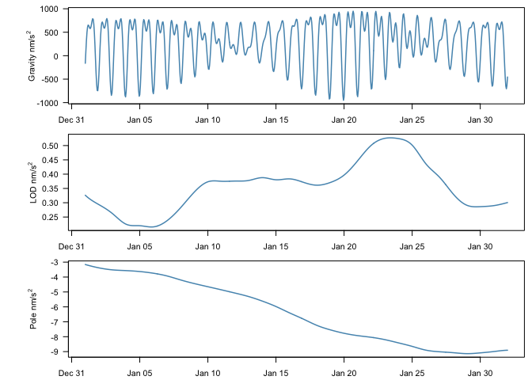

# earthtide [](https://doi.org/10.5281/zenodo.2673048) [](https://www.gnu.org/licenses/gpl-3.0) [](https://travis-ci.org/jkennel/earthtide) [](https://codecov.io/github/jkennel/earthtide?branch=master) [](https://cran.r-project.org/package=earthtide) [](https://cran.r-project.org/package=earthtide)

The **earthtide** package simplifies the generation of earth tides and
wave group harmonics for analysis in **R**.

## Background

**earthtide** is a port of the ‘Fortran ETERNA 3.4’ (Wenzel, 1996)
predict and part of the analyze codes with the Kudryavtsev 2004 update.
The original ‘Fortran’ code was rewritten in **R**, and **C++** using
the great **Rcpp**, **RcppArmadillo**, and **RcppParallel**. The package
is useful for generating synthetic earth tides using highly accurate
tidal catalogs for prediction and regression. Attempts were made to
ensure that results were consistent with the ‘ETERNA 3.4’, however,
there is always the possibility that a bug was introduced in during the
conversion and update.

Hartmann, T., Wenzel, H.-G., 1995. The HW95 tidal potential catalogue.
Geophys. Res. Lett. 22, 3553–3556.
\\url(<https://doi.org/10.1029/95GL03324>)

Kudryavtsev, S.M., 2004. Improved harmonic development of the Earth
tide-generating potential. J. Geod. 77, 829–838.
\\url(<https://doi.org/10.1007/s00190-003-0361-2>)

Wenzel, H.G. 1996: The nanogal software: Earth tide data processing
package ETERNA 3.30. Bull. Inf. Marges Terrestres. 124, 9425-9439.
\\url(<https://www.eas.slu.edu/GGP/ETERNA34/MANUAL/ETERNA33.HTM>)

## Installation

You can install the [CRAN](https://CRAN.R-project.org/package=earthtide)
version with the following command:

``` r
install.packages('earthtide')
```

The development version can be installed from github using the following
commands:

``` r
library(remotes)
remotes::install_github('jkennel/earthtide')
```

I will try to keep the IERS orientation datasets up-to-date in the
development version (weekly update).

## Predict

The following code computes the synthetic gravity, LOD tide, and pole
tide and returns a `data.frame` of results. To see the list of possible
arguments and methods of the Earthtide class use `?Earthtide`.

``` r
library(earthtide)

# One month of hourly data
tide <-  Earthtide$
  new(utc = as.POSIXct("2015-01-01", tz = "UTC") + 0:(24*31) * 3600,
      latitude = 52.3868,
      longitude = 9.7144,
      wave_groups = data.frame(start = 0.0, end = 6.0))$
  predict(method = "gravity", astro_update = 1)$    # compute gravity
  lod_tide()$                                       # LOD tide column
  pole_tide()$                                      # pole tide column
  tide()                                            # return result
```

<!-- -->

## Analyze

To generate curves for regression applications we can use the analyze
method. For each wave group, normalized sin and cosine curves are
generated.

``` r
wave_groups <- na.omit(eterna_wavegroups[eterna_wavegroups$time == '1 month', 
                                        c('start', 'end')])

tide_groups <-  Earthtide$
  new(utc = as.POSIXct("2015-01-01", tz = "UTC") + 0:(24*31) * 3600,
      latitude = 52.3868,
      longitude = 9.7144,
      wave_groups = wave_groups)$                                     
  analyze(method = 'gravity', astro_update = 1)$
  tide()

print(str(tide_groups))
```

    ## 'data.frame':    745 obs. of  31 variables:
    ##  $ datetime             : POSIXct, format: "2015-01-01 00:00:00" "2015-01-01 01:00:00" ...
    ##  $ cos_0.020885_0.054747: num  0.1119 0.1018 0.0918 0.0818 0.0717 ...
    ##  $ sin_0.020885_0.054747: num  1.05 1.05 1.06 1.06 1.06 ...
    ##  $ cos_0.054748_0.091348: num  -0.163 -0.175 -0.186 -0.197 -0.208 ...
    ##  $ sin_0.054748_0.091348: num  0.578 0.575 0.572 0.568 0.564 ...
    ##  $ cos_0.091349_0.501369: num  -0.492 -0.488 -0.484 -0.479 -0.474 ...
    ##  $ sin_0.091349_0.501369: num  -0.126 -0.139 -0.153 -0.166 -0.179 ...
    ##  $ cos_0.50137_0.91139  : num  -0.666 -0.599 -0.499 -0.372 -0.225 ...
    ##  $ sin_0.50137_0.91139  : num  -0.208 -0.357 -0.486 -0.588 -0.658 ...
    ##  $ cos_0.911391_0.947991: num  0.24 0.424 0.583 0.708 0.791 ...
    ##  $ sin_0.911391_0.947991: num  -0.794 -0.713 -0.59 -0.432 -0.248 ...
    ##  $ cos_0.947992_0.981854: num  -0.531 -0.757 -0.934 -1.053 -1.104 ...
    ##  $ sin_0.947992_0.981854: num  0.9688 0.8052 0.5902 0.3375 0.0632 ...
    ##  $ cos_0.981855_1.023622: num  -1.179 -1.052 -0.853 -0.595 -0.298 ...
    ##  $ sin_0.981855_1.023622: num  -0.336 -0.63 -0.881 -1.071 -1.189 ...
    ##  $ cos_1.023623_1.057485: num  0.172 0.367 0.535 0.664 0.744 ...
    ##  $ sin_1.023623_1.057485: num  -0.749 -0.675 -0.552 -0.388 -0.195 ...
    ##  $ cos_1.057486_1.470243: num  0.407 0.438 0.434 0.396 0.327 ...
    ##  $ sin_1.057486_1.470243: num  -0.1702 -0.0501 0.0738 0.1917 0.2943 ...
    ##  $ cos_1.470244_1.880264: num  -0.0785 -0.5245 -0.8474 -0.9719 -0.8692 ...
    ##  $ sin_1.470244_1.880264: num  0.9708 0.82 0.4778 0.0243 -0.4343 ...
    ##  $ cos_1.880265_1.914128: num  -0.599 -0.175 0.292 0.689 0.919 ...
    ##  $ sin_1.880265_1.914128: num  -0.74 -0.936 -0.906 -0.658 -0.251 ...
    ##  $ cos_1.914129_1.950419: num  0.664 0.965 1.025 0.828 0.424 ...
    ##  $ sin_1.914129_1.950419: num  -0.794 -0.373 0.141 0.62 0.944 ...
    ##  $ cos_1.95042_1.984282 : num  -0.6649 0.0143 0.6901 1.1869 1.3756 ...
    ##  $ sin_1.95042_1.984282 : num  -1.203 -1.3748 -1.1894 -0.695 -0.0199 ...
    ##  $ cos_1.984283_2.451943: num  -0.846 -0.633 -0.251 0.199 0.596 ...
    ##  $ sin_1.984283_2.451943: num  -0.2 -0.596 -0.833 -0.847 -0.634 ...
    ##  $ cos_2.451944_7       : num  1.0937 0.739 -0.0149 -0.7518 -1.0714 ...
    ##  $ sin_2.451944_7       : num  0.073 0.802 1.084 0.773 0.045 ...
    ## NULL

## Non-R6 function

There are two main methods for using the **earthtide** package. The
codes were developed using R6 classes, but wrappers have been written if
a more typical interface is desired. Both should give the same results,
but R6 stores more information about the calculations.

For example (the standard method):

``` r
tms <- as.POSIXct("2015-01-01", tz = "UTC") + 0:(24*31) * 3600
grav_std <- calc_earthtide(utc = tms, 
                           do_predict = TRUE,
                           method = 'gravity',
                           latitude = 52.3868,
                           longitude = 9.7144)
```

and the R6 method:

``` r
grav_r6 <- Earthtide$
  new(utc = tms,
      latitude = 52.3868,
      longitude = 9.7144)$
  predict(method = 'gravity')$
  tide()


all.equal(grav_std, grav_r6)
```

    ## [1] TRUE
