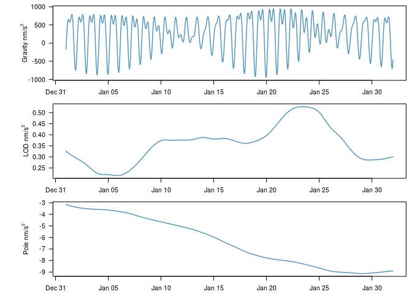

earthtide
=========

The **earthtide** package simplifies the generation of earth tides and wave group harmonics for analysis in **R**.

[](https://travis-ci.org/jkennel/earthtide) [](https://codecov.io/github/jkennel/earthtide?branch=master)

Background
==========

**earthtide** is a port of the 'Fortran ETERNA 3.4' (Wenzel, 1996) predict and part of the analyze codes with the Kudryavtsev 2004 update. The original 'Fortran' code was rewritten in **R**, and **C++** using the great **Rcpp**, **RcppArmadillo**, and **RcppParallel**. The package is useful for generating synthetic earth tides using highly accurate tidal catalogs for prediction and regression applications in **R**. Attempts were made to ensure that results were consistent with the 'ETERNA 3.4' results, however, there is always the possibility that a bug was introduced in during the conversion and update. For the most feature rich version and up-to-date version of 'ETERNA' please see <http://ggp.bkg.bund.de/eterna/> maintained by Klaus Schueller.

Hartmann, T., Wenzel, H.-G., 1995. The HW95 tidal potential catalogue. Geophys. Res. Lett. 22, 3553–3556.

Kudryavtsev, S.M., 2004. Improved harmonic development of the Earth tide-generating potential. J. Geod. 77, 829–838.

Wenzel, H.G. 1996: The nanogal software: Earth tide data processing package ETERNA 3.30. Bull. Inf. Marges Terrestres. 124, 9425-9439.

Installation
============

``` r
library(devtools)
install_github('jkennel/earthtide')
```

Example
=======

The following code computes the synthetic gravity, LOD tide, and pole tide and returns a data.frame of results.

``` r
library(earthtide)

# One month of hourly data
tide <-  Earthtide$
  new(utc = as.POSIXct("2015-01-01", tz = "UTC") + 0:(24*31) * 3600,
      latitude = 52.3868,
      longitude = 9.7144,
      wave_groups = data.frame(start = 0.0, end = 6.0))$
  predict(method = "gravity", astro_update = 1)$    # compute gravity
  lod_tide()$                                       # add LOD tide to results
  pole_tide()$                                      # add pole tide to results
  tide()                                            # get result data.frame
```


